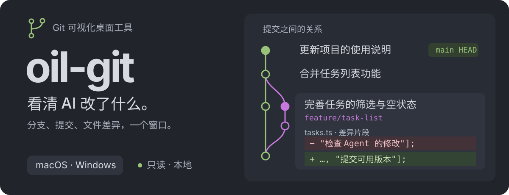
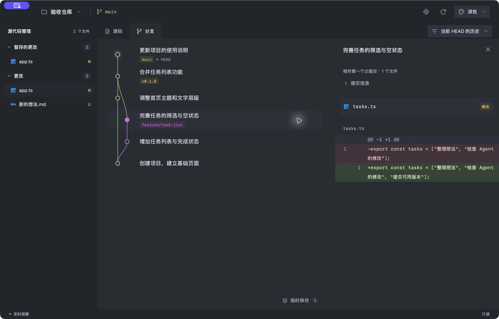

<p align="center">
  
</p>

<p align="center">
  <a href="https://github.com/oil-oil/oil-git/actions/workflows/build.yml"></a>
  · <a href="LICENSE">MIT</a>
  · <a href="#下载与开始">下载测试版</a>
  · <a href="docs/usage.md">使用说明</a>
  · <a href="skills/oil-git/SKILL.md">Agent Skill</a>
</p>

**oil-git 是一个只读的 Git 可视化桌面工具。** 打开自己的项目，就能看清当前分支、Agent 改了哪些文件，以及提交之间的关系。你继续在终端或 Agent 中操作 Git，窗口会跟着真实仓库的变化更新。

## 看效果

<p align="center">
  <a href="./assets/readme/app-dark.webp"></a>
</p>

上图来自实际安装的 Mac 测试包与真实验收仓库。顶部 SVG 是同一仓库数据的简化示意；点击窗口截图可查看原图。

## 能看清什么

| 你想确认             | oil-git 展示什么                                                    |
| -------------------- | ------------------------------------------------------------------- |
| 现在在哪个分支       | 提交图、父子关系、分支、标签与 HEAD；筛选后可返回 HEAD              |
| Agent 改了哪些文件   | 左侧按目录分类，区分已暂存、未暂存、未跟踪与冲突                    |
| 这次提交具体改了什么 | 点击节点查看文件与差异；提交信息按需展开                            |
| 修改前后有什么区别   | 左右对照或统一差异，默认自动换行，保留真实行号                      |
| 还有哪些仓库状态     | 工作树、stash、合并与 rebase 状态，以及本地记录的远程领先／落后数量 |

左侧文件列表常驻，右侧切换源码与分支。支持浅色、深色和绿色主题，各栏宽度可拖动调整，偏好保存在本机。

## 下载与开始

当前提供 **未签名的 0.1.0 测试版**，尚未发布正式 Release。

1. 打开 [桌面测试与安装包](https://github.com/oil-oil/oil-git/actions/workflows/build.yml)，选择最近一次通过的运行，在 **Artifacts** 下载对应平台的包。
   - **macOS Apple Silicon / Intel**：`mac-universal-unsigned-test`。解压后打开 DMG，将 oil-git 拖入 Applications。
   - **Windows x64**：`windows-x64-unsigned-test`。解压后运行其中以 `setup.exe` 结尾的安装程序。
2. 电脑需要已有 **Git**。应用启动时会检测；缺失时会提供安装入口和重新检测。运行应用无需 Python、Node 或 Rust。Windows 缺少 WebView2 时，安装器会下载微软运行组件。
3. 打开项目，或按 **⌘ O / Ctrl O**。选择项目子目录也能识别所属仓库。
4. 点击左侧文件查看差异，或在“分支”中点击提交节点查看详情。

Actions 安装包和检查报告保留 14 天。各平台的验证范围见 [验证说明](docs/verification.md)；CI 安装检查不代表所有原生窗口体验都已验收。

| 快捷键            | 操作               |
| ----------------- | ------------------ |
| ⌘ O / Ctrl O      | 打开项目           |
| ↑ / ↓，然后 Enter | 选择提交并查看详情 |
| Esc               | 关闭详情或取消拖拽 |
| ⌘ R / Ctrl R      | 刷新仓库           |

## 让 AI Agent 打开

随安装包提供 CLI 和 [oil-git Skill](skills/oil-git/SKILL.md)。将启动器加入 PATH 后，Agent 可以打开你正在做的项目，或读取真实仓库快照：

```bash
oil-git open "." --view changes
oil-git open "." --view history
oil-git inspect "." --json
oil-git skill --path
```

打开请求会复用已有窗口；`inspect` 输出只读 JSON，不启动窗口。Mac 启动器在应用的 `Contents/Resources/bin` 中，Windows 可直接调用安装目录中的 `oil-git.exe`。Skill 随包提供，安装应用不会自动修改 Agent 宿主的设置。完整路径与接入方式见 [CLI 使用说明](docs/usage.md#ai-agent-与-cli)。

## 只读与支持范围

oil-git 不执行提交、切分支、合并、拉取或撤销，也不改动所观察仓库的文件、暂存区、引用、配置与 LFS 对象。

- **标准 Git LFS** 可直接查看，无需安装 git-lfs。展示对象 ID 与大小，不自动下载文件；自定义 LFS 命令与扩展转换暂不支持。
- **其他活动外部 Git 过滤器**会明确提示原因，查看时不会运行仓库配置的转换程序。
- **普通与合并提交**默认比较第一个父提交；首次提交展示新增内容。
- **二进制文件**有单独提示，文本差异超过 **240 KB** 时明确标注截断。
- **裸仓库与部分克隆仓库**暂不支持。远程领先／落后数量以本地已有的跟踪记录为准。

## 开发与贡献

使用 **Tauri 2 + React + TypeScript + Rust**。Rust 通过系统 Git 读取仓库，桌面内部接口不开放本地 HTTP 服务；历史与代码采用可见区域渲染。

```bash
npm ci
npm run desktop
```

开发需要 Node 22、Rust 与当前平台的 Tauri 开发依赖。测试、打包和实现细节见 [开发文档](docs/development.md)，实际测试范围见 [验证说明](docs/verification.md)。欢迎提交能复现的问题或改进 PR。

## 许可证

[MIT](LICENSE)。文件类型图标来自 [Material Icon Theme](https://github.com/material-extensions/vscode-material-icon-theme)，其他素材说明见 [THIRD-PARTY-NOTICES.md](THIRD-PARTY-NOTICES.md)。
