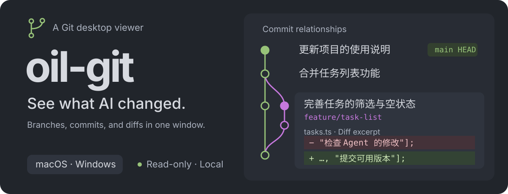
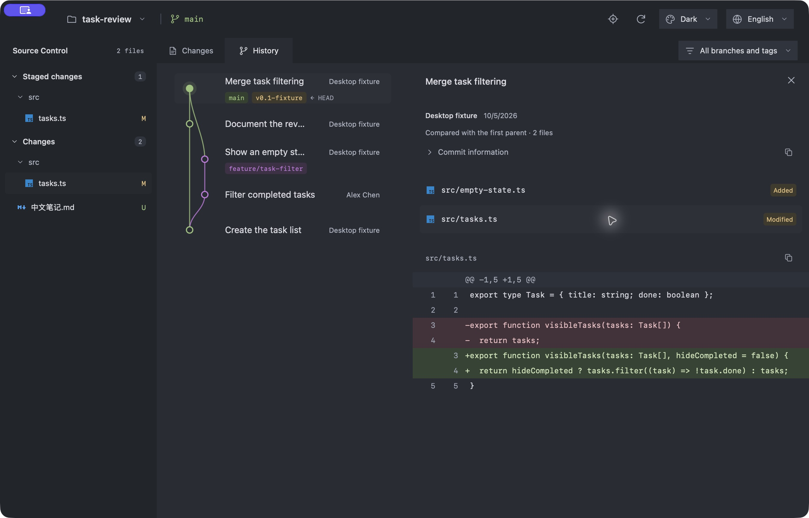

<p align="center">
  
</p>

<p align="center">
  <a href="https://github.com/oil-oil/oil-git/actions/workflows/build.yml"></a>
  · <a href="LICENSE">MIT</a>
  · <a href="https://github.com/oil-oil/oil-git/releases">Downloads</a>
  · <a href="docs/usage.md">Usage</a>
  · <a href="CONTRIBUTING.md">Contributing</a>
  · <a href="skills/oil-git/SKILL.md">Agent Skill</a>
  · <a href="README.zh-CN.md">简体中文</a>
</p>

**oil-git is a read-only desktop viewer for local Git repositories.** Open a project to inspect its current branch, working tree changes, commit history, and file diffs. Keep using Git in your editor, terminal, or agent; oil-git follows changes made to the real repository.

## What you can inspect

| Question                      | oil-git shows                                                                                            |
| ----------------------------- | -------------------------------------------------------------------------------------------------------- |
| Which branch am I on?         | The commit graph, parent relationships, local branches, tags, and `HEAD`                                 |
| What changed in this project? | Files grouped by merge conflicts, staged changes, and working tree changes                               |
| What does a commit contain?   | Its changed files, diff, author, date, and parent commits                                                |
| How did a file change?        | Side-by-side or unified text diffs with original line numbers; image comparison; media and byte previews |
| What is the repository state? | Worktrees, stashes, merge or rebase state, and locally recorded upstream counts                          |

## Screenshot

<p align="center">
  
</p>

Repository names, branches, commit messages, paths, and author details remain exactly as Git records them when the interface language changes.

The workspace sidebar stays visible while the right pane switches between changes and history. Choose a branch or tag to filter history; this only changes what is shown and never checks out a branch. Choose a worktree to observe it in the same way.

The interface supports English and Simplified Chinese. It follows the system language on first launch, then remembers the language you choose. Dark, light, and green themes are available as well.

## Install

Download the macOS DMG or Windows x64 installer from [GitHub Releases](https://github.com/oil-oil/oil-git/releases), and build the Linux deb, rpm, and AppImage packages with the [development instructions](docs/development.md#package). Feature scope follows the release tag and notes. For changes on the default branch, use the matching [CI build artifact](https://github.com/oil-oil/oil-git/actions/workflows/build.yml) or [build from source](docs/development.md). Git must be installed on the computer. The packaged app does not require Python, Node.js, or Rust at runtime.

Open a project from the toolbar or press **⌘ O** on macOS or **Ctrl O** elsewhere. Selecting a directory inside a repository opens its owning repository. Use **⌘ R** or **Ctrl R** to refresh.

## Agent and CLI

The packages include a CLI and the [oil-git Agent Skill](skills/oil-git/SKILL.md). The CLI can open a project in the existing app window or print a read-only JSON snapshot:

```sh
oil-git open . --view changes
oil-git open . --view history
oil-git inspect . --json
oil-git skill --path
oil-git --lang en --help
```

Use `--lang en` or `--lang zh-CN` with CLI commands to choose the language explicitly. Without it, each invocation reads the locale environment variables and defaults to English when none are set. This is independent of the saved interface language. `inspect` reads the local repository and does not open the app. The Skill is included with the package; installing oil-git does not change the host agent's settings. See the [CLI guide](docs/usage.md#cli-and-ai-agents) for launcher paths and integration details.

## Read-only boundary

oil-git does not commit, stage, switch branches, merge, fetch, pull, reset, or undo changes. It does not modify the observed repository's files, index, refs, configuration, or LFS object store.

- Standard Git LFS pointers are read with the app's built-in read-only filter. The app shows object IDs and sizes without downloading file contents. Custom LFS commands and extensions are unsupported.
- Repository-defined external content filters and converters are not run. If a filter prevents a safe read, the app explains the limitation.
- Bare and partial-clone repositories are not supported. Upstream ahead/behind counts use local tracking records and do not imply a fetch.

See the [usage guide](docs/usage.md#compare-files) for file comparison, media previews, and read limits.

## Development

oil-git uses Tauri 2, React, TypeScript, and Rust. Rust reads repositories through the system Git executable. The packaged app does not start a local HTTP server.

```sh
npm ci
npm run desktop
```

Development requires Node.js 22, Rust, and the Tauri dependencies for your platform. Read the [development guide](docs/development.md) and [usage guide](docs/usage.md), or their [Simplified Chinese versions](docs/zh-CN/development.md) and [中文使用说明](docs/zh-CN/usage.md). See [Contributing](CONTRIBUTING.md) before making changes.

## License

[MIT](LICENSE). File type icons come from [Material Icon Theme](https://github.com/material-extensions/vscode-material-icon-theme). See [third-party notices](THIRD-PARTY-NOTICES.md) for other bundled materials.
