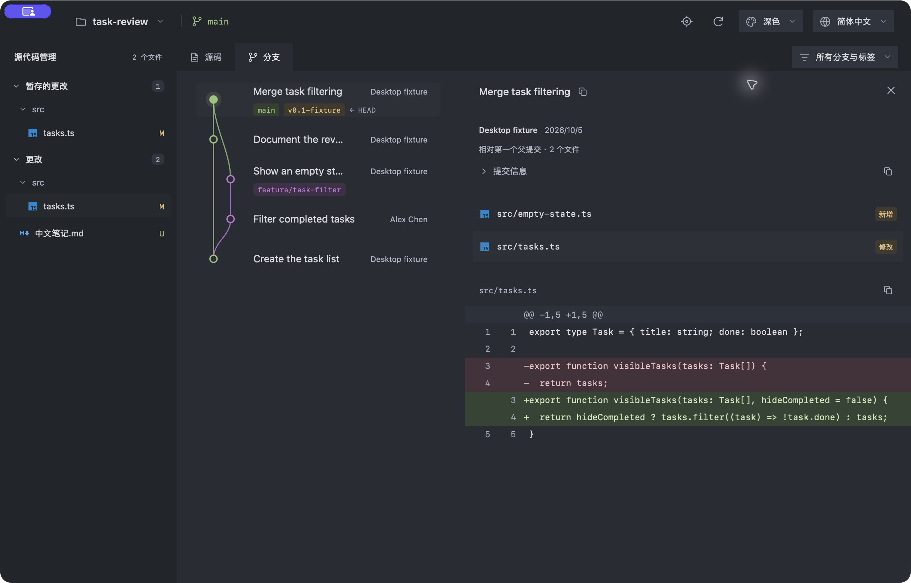

<p align="center">
  
</p>

<p align="center">
  <a href="https://github.com/oil-oil/oil-git/actions/workflows/build.yml"></a>
  · <a href="LICENSE">MIT</a>
  · <a href="https://github.com/oil-oil/oil-git/releases">下载</a>
  · <a href="docs/zh-CN/usage.md">使用说明</a>
  · <a href="CONTRIBUTING.md">贡献指南</a>
  · <a href="skills/oil-git/SKILL.zh-CN.md">Agent Skill</a>
  · <a href="README.md">English</a>
</p>

**oil-git 是一个只读的本地 Git 仓库可视化桌面工具。** 打开项目即可查看当前分支、工作区更改、提交历史和文件差异。你继续在编辑器、终端或 Agent 中使用 Git，oil-git 会跟随真实仓库的变化更新。

## 可以查看什么

| 你想确认           | oil-git 展示什么                                                    |
| ------------------ | ------------------------------------------------------------------- |
| 当前在哪个分支     | 提交图、父子关系、本地分支、标签与 `HEAD`                           |
| 项目改了哪些内容   | 按合并冲突、已暂存更改和工作区更改分组的文件                        |
| 一次提交包含什么   | 变更文件、差异、作者、时间和父提交                                  |
| 文件具体如何变化   | 保留原始行号的左右对照或统一文本差异、图片对比，以及媒体和字节预览  |
| 仓库目前是什么状态 | 工作树、stash、合并或 rebase 状态，以及本地已有的上游领先／落后记录 |

工作区侧栏常驻，右侧可切换更改与历史。选择分支或标签只筛选显示的历史，不会切换分支；选择工作树只是查看该工作树。

界面支持英文和简体中文。首次启动时根据系统语言选择，之后会记住你的手动设置。也支持深色、浅色和绿色主题。

## 界面预览

<p align="center">
  
</p>

切换界面语言不会翻译仓库名称、分支、提交信息、路径或作者等 Git 原始内容。

## 安装

目前 [GitHub Releases](https://github.com/oil-oil/oil-git/releases) 中的是较早的测试版本，可能不包含本分支的双语界面与 CLI 更新。要体验当前改动，请使用对应提交的 [GitHub Actions 构建产物](https://github.com/oil-oil/oil-git/actions/workflows/build.yml)或[从源码构建](docs/zh-CN/development.md)。电脑需要已安装 Git；运行打包后的应用不需要 Python、Node.js 或 Rust。

从工具栏打开项目，或按 macOS **⌘ O**、Windows **Ctrl O**。选择仓库内的子目录也会打开所属仓库。按 **⌘ R** 或 **Ctrl R** 刷新。

## Agent 与 CLI

安装包包含 CLI 和 [oil-git Agent Skill](skills/oil-git/SKILL.zh-CN.md)。CLI 可以在现有应用窗口打开项目，或输出只读 JSON 快照：

```sh
oil-git open . --view changes
oil-git open . --view history
oil-git inspect . --json
oil-git skill --path
oil-git --lang zh-CN --help
```

可对 CLI 命令使用 `--lang en` 或 `--lang zh-CN` 指定语言；不指定时按可用的系统区域设置选择。`inspect` 只读取本地仓库，不会打开窗口。Skill 随安装包提供，安装 oil-git 不会修改 Agent 宿主设置。启动器路径和接入方式见 [CLI 使用说明](docs/zh-CN/usage.md#cli-与-ai-agent)。

## 只读边界

oil-git 不执行提交、暂存、切换分支、合并、fetch、pull、reset 或撤销，也不修改所观察仓库的文件、暂存区、引用、配置或 LFS 对象库。

- 标准 Git LFS 指针由应用自带的只读过滤器读取。应用展示对象 ID 和大小，不下载文件内容；自定义 LFS 命令与扩展暂不支持。
- 不运行仓库配置的外部内容过滤器或转换程序。若过滤器阻止安全读取，应用会说明限制。
- 提交默认与第一个父提交比较；首次提交显示为新增内容。
- 图片可视化对比；数据可用时，音频和视频通过系统媒体控件查看。其他二进制文件每侧最多比较前 4 KiB 字节。
- 文本差异最多读取 240 KB，超出时会明确标注截断。媒体预览输入上限为 8 MiB，大图片还有像素上限。
- 暂不支持裸仓库和部分克隆仓库。上游领先／落后数量来自本地跟踪记录，不代表执行了 fetch。

## 开发

oil-git 使用 Tauri 2、React、TypeScript 和 Rust。Rust 通过系统 Git 读取仓库，桌面应用不开放本地 HTTP 服务。

```sh
npm ci
npm run desktop
```

开发需要 Node.js 22、Rust 和当前平台的 Tauri 开发依赖。参阅[开发文档](docs/zh-CN/development.md)和[使用说明](docs/zh-CN/usage.md)，也可阅读英文版[开发文档](docs/development.md)与[使用说明](docs/usage.md)。贡献前请阅读[贡献指南](CONTRIBUTING.md)。

## 许可证

[MIT](LICENSE)。文件类型图标来自 [Material Icon Theme](https://github.com/material-extensions/vscode-material-icon-theme)，其他随附素材见[第三方声明](docs/zh-CN/third-party-notices.md)。
